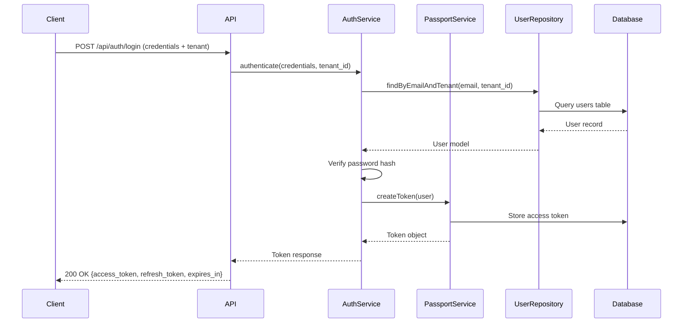
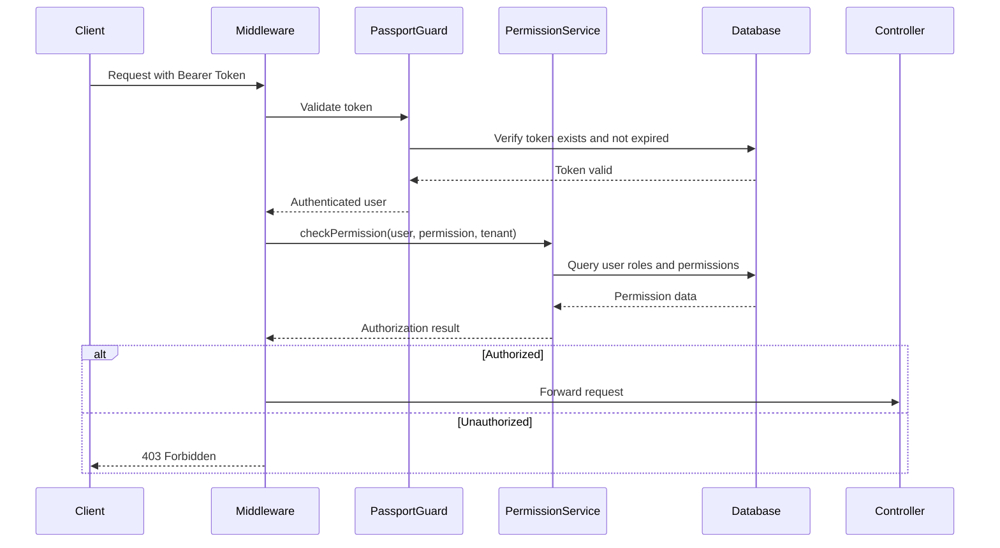

# Design Document: Authentication and Authorization

## Overview

This design implements a comprehensive authentication and authorization system for a multi-tenant Laravel API using Laravel Passport for OAuth2 token-based authentication and Spatie Laravel Permission for role-based access control (RBAC). The system ensures strict tenant isolation at all layers while providing flexible, granular permission management.

### Key Design Principles

1. **Tenant Isolation First**: All authentication and authorization operations are scoped to the current tenant context
2. **OAuth2 Standard Compliance**: Full OAuth2 implementation via Laravel Passport for industry-standard token management
3. **Layered Security**: Multiple security layers including token validation, permission checks, and tenant boundary enforcement
4. **Service-Repository Pattern**: Clean separation of concerns with business logic in services and data access in repositories
5. **Stateless API Authentication**: Token-based authentication suitable for distributed API architectures

### Technology Stack

- **Laravel Passport 13.7+**: OAuth2 server implementation for token-based authentication
- **Spatie Laravel Permission 7.3+**: Role and permission management with database-driven authorization
- **PostgreSQL**: Primary database with support for tenant-scoped queries
- **Redis**: Token caching and rate limiting (via Predis)
- **Spatie Activity Log 5.0+**: Audit logging for authentication events

## Architecture

### High-Level Architecture

```
┌─────────────────────────────────────────────────────────────┐
│                      API Request Layer                       │
│  (HTTP Request with Bearer Token + Tenant Identifier)        │
└────────────────────────┬────────────────────────────────────┘
                         │
                         ▼
┌─────────────────────────────────────────────────────────────┐
│                   Middleware Pipeline                        │
│  ┌──────────────┐  ┌──────────────┐  ┌──────────────┐      │
│  │   Tenant     │→ │   Passport   │→ │  Permission  │      │
│  │   Context    │  │     Auth     │  │    Check     │      │
│  └──────────────┘  └──────────────┘  └──────────────┘      │
└────────────────────────┬────────────────────────────────────┘
                         │
                         ▼
┌─────────────────────────────────────────────────────────────┐
│                    Controller Layer                          │
│         (Thin controllers, delegate to services)             │
└────────────────────────┬────────────────────────────────────┘
                         │
                         ▼
┌─────────────────────────────────────────────────────────────┐
│                     Service Layer                            │
│  ┌──────────────┐  ┌──────────────┐  ┌──────────────┐      │
│  │    Auth      │  │  Permission  │  │    Token     │      │
│  │   Service    │  │   Service    │  │   Service    │      │
│  └──────┬───────┘  └──────┬───────┘  └──────┬───────┘      │
└─────────┼──────────────────┼──────────────────┼─────────────┘
          │                  │                  │
          ▼                  ▼                  ▼
┌─────────────────────────────────────────────────────────────┐
│                   Repository Layer                           │
│  ┌──────────────┐  ┌──────────────┐  ┌──────────────┐      │
│  │     User     │  │     Role     │  │    Token     │      │
│  │  Repository  │  │  Repository  │  │  Repository  │      │
│  └──────┬───────┘  └──────┬───────┘  └──────┬───────┘      │
└─────────┼──────────────────┼──────────────────┼─────────────┘
          │                  │                  │
          ▼                  ▼                  ▼
┌─────────────────────────────────────────────────────────────┐
│                      Data Layer                              │
│  ┌──────────────┐  ┌──────────────┐  ┌──────────────┐      │
│  │    Users     │  │    Roles     │  │   Tokens     │      │
│  │    Table     │  │    Table     │  │    Table     │      │
│  └──────────────┘  └──────────────┘  └──────────────┘      │
└─────────────────────────────────────────────────────────────┘
```

### Authentication Flow



### Authorization Flow



## Components and Interfaces

### Service Layer

#### AuthService

**Purpose**: Handles all authentication business logic including registration, login, logout, and password management.

**Dependencies**:
- `UserRepositoryInterface`
- `TokenRepositoryInterface`
- `TenantRepositoryInterface`
- `Illuminate\Support\Facades\Hash`
- `Illuminate\Support\Facades\Event`

**Key Methods**:

```php
interface AuthServiceInterface
{
    /**
     * Register a new user within a tenant context
     */
    public function register(array $data, int $tenantId): User;
    
    /**
     * Authenticate user and issue tokens
     */
    public function login(string $email, string $password, int $tenantId): array;
    
    /**
     * Refresh access token using refresh token
     */
    public function refreshToken(string $refreshToken): array;
    
    /**
     * Revoke user's tokens (logout)
     */
    public function logout(User $user): bool;
    
    /**
     * Request password reset token
     */
    public function requestPasswordReset(string $email, int $tenantId): bool;
    
    /**
     * Reset password using token
     */
    public function resetPassword(string $token, string $email, string $password): bool;
    
    /**
     * Send email verification
     */
    public function sendEmailVerification(User $user): bool;
    
    /**
     * Verify email with token
     */
    public function verifyEmail(string $token): bool;
}
```

#### PermissionService

**Purpose**: Manages role and permission assignment, checking, and tenant-scoped authorization.

**Dependencies**:
- `RoleRepositoryInterface`
- `PermissionRepositoryInterface`
- `UserRepositoryInterface`
- `Illuminate\Support\Facades\Cache`

**Key Methods**:

```php
interface PermissionServiceInterface
{
    /**
     * Assign role to user within tenant context
     */
    public function assignRole(User $user, string $roleName, int $tenantId): bool;
    
    /**
     * Remove role from user
     */
    public function removeRole(User $user, string $roleName, int $tenantId): bool;
    
    /**
     * Assign permission to role
     */
    public function assignPermissionToRole(string $roleName, string $permissionName, int $tenantId): bool;
    
    /**
     * Check if user has permission within tenant
     */
    public function hasPermission(User $user, string $permission, int $tenantId): bool;
    
    /**
     * Check if user has role within tenant
     */
    public function hasRole(User $user, string $role, int $tenantId): bool;
    
    /**
     * Get all permissions for user within tenant
     */
    public function getUserPermissions(User $user, int $tenantId): Collection;
    
    /**
     * Create a new role within tenant
     */
    public function createRole(string $name, int $tenantId, ?string $guardName = null): Role;
    
    /**
     * Sync permissions for a role
     */
    public function syncRolePermissions(string $roleName, array $permissions, int $tenantId): bool;
}
```

#### TokenService

**Purpose**: Manages OAuth2 token operations including personal access tokens and token validation.

**Dependencies**:
- `TokenRepositoryInterface`
- `Laravel\Passport\Passport`

**Key Methods**:

```php
interface TokenServiceInterface
{
    /**
     * Create personal access token for user
     */
    public function createPersonalAccessToken(User $user, string $name, array $scopes = []): string;
    
    /**
     * Revoke specific token
     */
    public function revokeToken(string $tokenId): bool;
    
    /**
     * Revoke all tokens for user
     */
    public function revokeAllUserTokens(User $user): bool;
    
    /**
     * Validate token and return associated user
     */
    public function validateToken(string $token): ?User;
    
    /**
     * Check if token has required scopes
     */
    public function tokenHasScopes(string $tokenId, array $scopes): bool;
}
```

### Repository Layer

#### UserRepositoryInterface

```php
interface UserRepositoryInterface
{
    public function find(int $id): ?User;
    
    public function findByEmail(string $email, int $tenantId): ?User;
    
    public function create(array $data): User;
    
    public function update(User $user, array $data): User;
    
    public function delete(User $user): bool;
    
    public function findByEmailVerificationToken(string $token): ?User;
    
    public function getAllByTenant(int $tenantId): Collection;
}
```

#### RoleRepositoryInterface

```php
interface RoleRepositoryInterface
{
    public function findByName(string $name, int $tenantId, ?string $guardName = null): ?Role;
    
    public function create(array $data): Role;
    
    public function getAllByTenant(int $tenantId): Collection;
    
    public function assignToUser(User $user, Role $role): bool;
    
    public function removeFromUser(User $user, Role $role): bool;
    
    public function syncPermissions(Role $role, array $permissions): bool;
}
```

#### TokenRepositoryInterface

```php
interface TokenRepositoryInterface
{
    public function findById(string $id): ?Token;
    
    public function findByUser(User $user): Collection;
    
    public function revoke(string $tokenId): bool;
    
    public function revokeAllForUser(User $user): bool;
    
    public function findByRefreshToken(string $refreshToken): ?Token;
}
```

### Middleware Components

#### TenantContextMiddleware

**Purpose**: Identifies and sets the current tenant context for the request.

**Responsibilities**:
- Extract tenant identifier from request (header, subdomain, or parameter)
- Validate tenant exists
- Set tenant context in application container
- Scope all subsequent queries to tenant

#### PassportAuthMiddleware

**Purpose**: Validates OAuth2 bearer tokens using Laravel Passport.

**Responsibilities**:
- Extract bearer token from Authorization header
- Validate token with Passport
- Load authenticated user
- Verify token not expired or revoked

#### RoleMiddleware

**Purpose**: Enforce role-based access control on routes.

**Responsibilities**:
- Check authenticated user has required role(s)
- Support OR and AND logic for multiple roles
- Return 403 if unauthorized

#### PermissionMiddleware

**Purpose**: Enforce permission-based access control on routes.

**Responsibilities**:
- Check authenticated user has required permission(s)
- Support OR and AND logic for multiple permissions
- Return 403 if unauthorized

### Controller Layer

Controllers remain thin and delegate all logic to services:

```php
class AuthController extends Controller
{
    public function __construct(
        private readonly AuthServiceInterface $authService
    ) {}

    public function register(RegisterRequest $request): JsonResponse
    {
        $user = $this->authService->register(
            $request->validated(),
            $request->tenantId()
        );
        
        return (new UserResource($user))
            ->response()
            ->setStatusCode(201);
    }

    public function login(LoginRequest $request): JsonResponse
    {
        $tokens = $this->authService->login(
            $request->input('email'),
            $request->input('password'),
            $request->tenantId()
        );
        
        return response()->json($tokens);
    }
}
```

## Data Models

### Database Schema

#### Users Table

```sql
CREATE TABLE users (
    id BIGSERIAL PRIMARY KEY,
    tenant_id BIGINT NOT NULL,
    name VARCHAR(255) NOT NULL,
    email VARCHAR(255) NOT NULL,
    email_verified_at TIMESTAMP NULL,
    password VARCHAR(255) NOT NULL,
    remember_token VARCHAR(100) NULL,
    created_at TIMESTAMP NOT NULL DEFAULT CURRENT_TIMESTAMP,
    updated_at TIMESTAMP NOT NULL DEFAULT CURRENT_TIMESTAMP,
    
    CONSTRAINT users_tenant_email_unique UNIQUE (tenant_id, email),
    CONSTRAINT users_tenant_fk FOREIGN KEY (tenant_id) 
        REFERENCES tenants(id) ON DELETE CASCADE
);

CREATE INDEX users_tenant_id_index ON users(tenant_id);
CREATE INDEX users_email_index ON users(email);
```

#### OAuth Tables (Laravel Passport)

```sql
-- OAuth Clients
CREATE TABLE oauth_clients (
    id BIGSERIAL PRIMARY KEY,
    tenant_id BIGINT NULL,
    user_id BIGINT NULL,
    name VARCHAR(255) NOT NULL,
    secret VARCHAR(100) NULL,
    provider VARCHAR(255) NULL,
    redirect TEXT NOT NULL,
    personal_access_client BOOLEAN NOT NULL DEFAULT FALSE,
    password_client BOOLEAN NOT NULL DEFAULT FALSE,
    revoked BOOLEAN NOT NULL DEFAULT FALSE,
    created_at TIMESTAMP NOT NULL DEFAULT CURRENT_TIMESTAMP,
    updated_at TIMESTAMP NOT NULL DEFAULT CURRENT_TIMESTAMP,
    
    CONSTRAINT oauth_clients_tenant_fk FOREIGN KEY (tenant_id)
        REFERENCES tenants(id) ON DELETE CASCADE
);

-- OAuth Access Tokens
CREATE TABLE oauth_access_tokens (
    id VARCHAR(100) PRIMARY KEY,
    user_id BIGINT NULL,
    client_id BIGINT NOT NULL,
    name VARCHAR(255) NULL,
    scopes TEXT NULL,
    revoked BOOLEAN NOT NULL DEFAULT FALSE,
    created_at TIMESTAMP NOT NULL DEFAULT CURRENT_TIMESTAMP,
    updated_at TIMESTAMP NOT NULL DEFAULT CURRENT_TIMESTAMP,
    expires_at TIMESTAMP NULL,
    
    CONSTRAINT oauth_access_tokens_user_fk FOREIGN KEY (user_id)
        REFERENCES users(id) ON DELETE CASCADE
);

CREATE INDEX oauth_access_tokens_user_id_index ON oauth_access_tokens(user_id);

-- OAuth Refresh Tokens
CREATE TABLE oauth_refresh_tokens (
    id VARCHAR(100) PRIMARY KEY,
    access_token_id VARCHAR(100) NOT NULL,
    revoked BOOLEAN NOT NULL DEFAULT FALSE,
    expires_at TIMESTAMP NULL,
    
    CONSTRAINT oauth_refresh_tokens_access_token_fk FOREIGN KEY (access_token_id)
        REFERENCES oauth_access_tokens(id) ON DELETE CASCADE
);

CREATE INDEX oauth_refresh_tokens_access_token_id_index ON oauth_refresh_tokens(access_token_id);

-- OAuth Personal Access Clients
CREATE TABLE oauth_personal_access_clients (
    id BIGSERIAL PRIMARY KEY,
    client_id BIGINT NOT NULL,
    created_at TIMESTAMP NOT NULL DEFAULT CURRENT_TIMESTAMP,
    updated_at TIMESTAMP NOT NULL DEFAULT CURRENT_TIMESTAMP
);

-- OAuth Auth Codes
CREATE TABLE oauth_auth_codes (
    id VARCHAR(100) PRIMARY KEY,
    user_id BIGINT NOT NULL,
    client_id BIGINT NOT NULL,
    scopes TEXT NULL,
    revoked BOOLEAN NOT NULL DEFAULT FALSE,
    expires_at TIMESTAMP NULL
);
```

#### Roles and Permissions Tables (Spatie Permission)

```sql
-- Permissions
CREATE TABLE permissions (
    id BIGSERIAL PRIMARY KEY,
    name VARCHAR(255) NOT NULL,
    guard_name VARCHAR(255) NOT NULL,
    created_at TIMESTAMP NOT NULL DEFAULT CURRENT_TIMESTAMP,
    updated_at TIMESTAMP NOT NULL DEFAULT CURRENT_TIMESTAMP,
    
    CONSTRAINT permissions_name_guard_unique UNIQUE (name, guard_name)
);

-- Roles
CREATE TABLE roles (
    id BIGSERIAL PRIMARY KEY,
    tenant_id BIGINT NOT NULL,
    name VARCHAR(255) NOT NULL,
    guard_name VARCHAR(255) NOT NULL,
    created_at TIMESTAMP NOT NULL DEFAULT CURRENT_TIMESTAMP,
    updated_at TIMESTAMP NOT NULL DEFAULT CURRENT_TIMESTAMP,
    
    CONSTRAINT roles_tenant_name_guard_unique UNIQUE (tenant_id, name, guard_name),
    CONSTRAINT roles_tenant_fk FOREIGN KEY (tenant_id)
        REFERENCES tenants(id) ON DELETE CASCADE
);

CREATE INDEX roles_tenant_id_index ON roles(tenant_id);

-- Model Has Permissions (Direct permissions to users)
CREATE TABLE model_has_permissions (
    permission_id BIGINT NOT NULL,
    model_type VARCHAR(255) NOT NULL,
    model_id BIGINT NOT NULL,
    tenant_id BIGINT NOT NULL,
    
    PRIMARY KEY (permission_id, model_id, model_type, tenant_id),
    
    CONSTRAINT model_has_permissions_permission_fk FOREIGN KEY (permission_id)
        REFERENCES permissions(id) ON DELETE CASCADE,
    CONSTRAINT model_has_permissions_tenant_fk FOREIGN KEY (tenant_id)
        REFERENCES tenants(id) ON DELETE CASCADE
);

CREATE INDEX model_has_permissions_model_index ON model_has_permissions(model_id, model_type);

-- Model Has Roles
CREATE TABLE model_has_roles (
    role_id BIGINT NOT NULL,
    model_type VARCHAR(255) NOT NULL,
    model_id BIGINT NOT NULL,
    tenant_id BIGINT NOT NULL,
    
    PRIMARY KEY (role_id, model_id, model_type, tenant_id),
    
    CONSTRAINT model_has_roles_role_fk FOREIGN KEY (role_id)
        REFERENCES roles(id) ON DELETE CASCADE,
    CONSTRAINT model_has_roles_tenant_fk FOREIGN KEY (tenant_id)
        REFERENCES tenants(id) ON DELETE CASCADE
);

CREATE INDEX model_has_roles_model_index ON model_has_roles(model_id, model_type);

-- Role Has Permissions
CREATE TABLE role_has_permissions (
    permission_id BIGINT NOT NULL,
    role_id BIGINT NOT NULL,
    
    PRIMARY KEY (permission_id, role_id),
    
    CONSTRAINT role_has_permissions_permission_fk FOREIGN KEY (permission_id)
        REFERENCES permissions(id) ON DELETE CASCADE,
    CONSTRAINT role_has_permissions_role_fk FOREIGN KEY (role_id)
        REFERENCES roles(id) ON DELETE CASCADE
);
```

#### Password Reset Tokens Table

```sql
CREATE TABLE password_reset_tokens (
    email VARCHAR(255) NOT NULL,
    tenant_id BIGINT NOT NULL,
    token VARCHAR(255) NOT NULL,
    created_at TIMESTAMP NOT NULL DEFAULT CURRENT_TIMESTAMP,
    
    PRIMARY KEY (email, tenant_id),
    
    CONSTRAINT password_reset_tokens_tenant_fk FOREIGN KEY (tenant_id)
        REFERENCES tenants(id) ON DELETE CASCADE
);

CREATE INDEX password_reset_tokens_email_index ON password_reset_tokens(email);
```

### Eloquent Models

#### User Model

```php
namespace App\Models;

use Illuminate\Foundation\Auth\User as Authenticatable;
use Laravel\Passport\HasApiTokens;
use Spatie\Permission\Traits\HasRoles;
use Illuminate\Notifications\Notifiable;

class User extends Authenticatable
{
    use HasApiTokens, HasRoles, Notifiable;

    protected $fillable = [
        'tenant_id',
        'name',
        'email',
        'password',
        'email_verified_at',
    ];

    protected $hidden = [
        'password',
        'remember_token',
    ];

    protected function casts(): array
    {
        return [
            'email_verified_at' => 'datetime',
            'password' => 'hashed',
        ];
    }

    /**
     * Get the tenant that owns the user
     */
    public function tenant(): BelongsTo
    {
        return $this->belongsTo(Tenant::class);
    }

    /**
     * Scope query to specific tenant
     */
    public function scopeForTenant(Builder $query, int $tenantId): Builder
    {
        return $query->where('tenant_id', $tenantId);
    }

    /**
     * Override Spatie's getPermissionsViaRoles to scope by tenant
     */
    public function getPermissionsViaRoles(): Collection
    {
        return $this->loadMissing('roles', 'roles.permissions')
            ->roles
            ->where('tenant_id', $this->tenant_id)
            ->flatMap(fn($role) => $role->permissions)
            ->sort()
            ->values();
    }
}
```

#### Role Model (Extended Spatie)

```php
namespace App\Models;

use Spatie\Permission\Models\Role as SpatieRole;

class Role extends SpatieRole
{
    protected $fillable = [
        'tenant_id',
        'name',
        'guard_name',
    ];

    /**
     * Get the tenant that owns the role
     */
    public function tenant(): BelongsTo
    {
        return $this->belongsTo(Tenant::class);
    }

    /**
     * Scope query to specific tenant
     */
    public function scopeForTenant(Builder $query, int $tenantId): Builder
    {
        return $query->where('tenant_id', $tenantId);
    }
}
```

### Tenant Context Management

The system uses a tenant context resolver to ensure all queries are automatically scoped:

```php
namespace App\Services;

class TenantContext
{
    private ?int $currentTenantId = null;

    public function setTenant(int $tenantId): void
    {
        $this->currentTenantId = $tenantId;
    }

    public function getTenant(): ?int
    {
        return $this->currentTenantId;
    }

    public function hasTenant(): bool
    {
        return $this->currentTenantId !== null;
    }

    public function clear(): void
    {
        $this->currentTenantId = null;
    }
}
```

## Error Handling

### Custom Exceptions

```php
namespace App\Exceptions\Auth;

// Authentication Exceptions
class InvalidCredentialsException extends AuthException
{
    protected $message = 'The provided credentials are invalid.';
    protected $code = 401;
}

class UserNotFoundException extends AuthException
{
    protected $message = 'User not found in the specified tenant.';
    protected $code = 404;
}

class TokenExpiredException extends AuthException
{
    protected $message = 'The authentication token has expired.';
    protected $code = 401;
}

class TokenRevokedException extends AuthException
{
    protected $message = 'The authentication token has been revoked.';
    protected $code = 401;
}

class EmailNotVerifiedException extends AuthException
{
    protected $message = 'Email address has not been verified.';
    protected $code = 403;
}

// Authorization Exceptions
class InsufficientPermissionsException extends AuthException
{
    protected $message = 'You do not have permission to perform this action.';
    protected $code = 403;
}

class RoleNotFoundException extends AuthException
{
    protected $message = 'The specified role does not exist.';
    protected $code = 404;
}

class CrossTenantAccessException extends AuthException
{
    protected $message = 'Cross-tenant access is not permitted.';
    protected $code = 403;
}

// Password Reset Exceptions
class InvalidResetTokenException extends AuthException
{
    protected $message = 'The password reset token is invalid or expired.';
    protected $code = 400;
}
```

### Exception Handler

```php
namespace App\Exceptions;

use App\Exceptions\Auth\AuthException;
use Illuminate\Foundation\Exceptions\Handler as ExceptionHandler;

class Handler extends ExceptionHandler
{
    public function register(): void
    {
        $this->renderable(function (AuthException $e, $request) {
            if ($request->expectsJson()) {
                return response()->json([
                    'message' => $e->getMessage(),
                    'error' => class_basename($e),
                ], $e->getCode());
            }
        });
    }
}
```

## Testing Strategy

This feature requires a comprehensive testing approach combining unit tests for business logic, repository tests for data access, and feature tests for end-to-end API flows.

### Unit Testing

**Service Tests** - Test business logic with mocked repositories:
- Test authentication flows (register, login, logout)
- Test permission checking logic
- Test role assignment logic
- Test token management operations
- Mock all repository dependencies
- Verify correct repository methods are called
- Test exception handling

**Repository Tests** - Test data access with real database:
- Test user CRUD operations with tenant scoping
- Test role and permission queries
- Test token storage and retrieval
- Use SQLite in-memory database
- Verify tenant isolation at database level
- Test unique constraints and foreign keys

### Feature Testing

**API Endpoint Tests** - Test complete request/response cycles:
- Test registration endpoint with tenant context
- Test login endpoint returns valid tokens
- Test token refresh flow
- Test logout revokes tokens
- Test password reset flow
- Test protected routes require authentication
- Test role-based middleware protection
- Test permission-based middleware protection
- Test cross-tenant access prevention
- Verify proper HTTP status codes
- Verify JSON response structures

### Test Organization

```
tests/
├── Feature/
│   ├── Auth/
│   │   ├── RegistrationTest.php
│   │   ├── LoginTest.php
│   │   ├── LogoutTest.php
│   │   ├── PasswordResetTest.php
│   │   └── EmailVerificationTest.php
│   ├── Authorization/
│   │   ├── RoleAssignmentTest.php
│   │   ├── PermissionCheckTest.php
│   │   └── MiddlewareProtectionTest.php
│   └── MultiTenant/
│       ├── TenantIsolationTest.php
│       └── CrossTenantAccessTest.php
├── Unit/
│   ├── Services/
│   │   ├── AuthServiceTest.php
│   │   ├── PermissionServiceTest.php
│   │   └── TokenServiceTest.php
│   └── Repositories/
│       ├── UserRepositoryTest.php
│       ├── RoleRepositoryTest.php
│       └── TokenRepositoryTest.php
```

### Testing Best Practices

1. **Use Factories**: Generate test data with model factories for consistency
2. **RefreshDatabase Trait**: Ensure clean database state for each test
3. **Arrange-Act-Assert**: Structure all tests with clear setup, execution, and verification
4. **Test Edge Cases**: Cover validation failures, not found scenarios, permission denied cases
5. **Mock External Services**: Mock email sending, event dispatching in unit tests
6. **Test Tenant Isolation**: Verify users cannot access data from other tenants
7. **Test Token Lifecycle**: Verify tokens expire, refresh, and revoke correctly

### Example Test Cases

```php
// Feature Test Example
test('user can register within tenant context', function () {
    $tenant = Tenant::factory()->create();
    
    $response = $this->postJson('/api/auth/register', [
        'name' => 'John Doe',
        'email' => 'john@example.com',
        'password' => 'password123',
        'password_confirmation' => 'password123',
        'tenant_id' => $tenant->id,
    ]);
    
    $response->assertCreated()
        ->assertJsonStructure([
            'data' => ['id', 'name', 'email', 'tenant_id']
        ]);
    
    $this->assertDatabaseHas('users', [
        'email' => 'john@example.com',
        'tenant_id' => $tenant->id,
    ]);
});

// Unit Test Example
test('auth service creates user with hashed password', function () {
    $userRepo = Mockery::mock(UserRepositoryInterface::class);
    $tenantRepo = Mockery::mock(TenantRepositoryInterface::class);
    
    $tenant = new Tenant(['id' => 1]);
    $tenantRepo->shouldReceive('find')->with(1)->andReturn($tenant);
    
    $userRepo->shouldReceive('create')
        ->once()
        ->with(Mockery::on(function ($data) {
            return Hash::check('password123', $data['password']);
        }))
        ->andReturn(new User(['id' => 1, 'email' => 'test@example.com']));
    
    $service = new AuthService($userRepo, $tenantRepo);
    $user = $service->register([
        'email' => 'test@example.com',
        'password' => 'password123',
    ], 1);
    
    expect($user)->toBeInstanceOf(User::class);
});
```

## Correctness Properties

*A property is a characteristic or behavior that should hold true across all valid executions of a system—essentially, a formal statement about what the system should do. Properties serve as the bridge between human-readable specifications and machine-verifiable correctness guarantees.*

### Property 1: Tenant-Scoped User Creation

*For any* valid user registration data and tenant identifier, the created user SHALL be associated with the specified tenant and SHALL NOT be accessible from queries scoped to other tenants.

**Validates: Requirements 1.1, 5.2**

### Property 2: Tenant-Scoped Email Uniqueness

*For any* email address, the system SHALL allow multiple users with the same email across different tenants, but SHALL reject duplicate emails within the same tenant.

**Validates: Requirements 1.2, 1.5**

### Property 3: Password Security

*For any* password provided during registration or password reset, the system SHALL store only the bcrypt hash and SHALL never store or return the plain-text password in any response.

**Validates: Requirements 1.3, 1.4, 13.3, 14.4**

### Property 4: Input Validation Completeness

*For any* registration or authentication request with missing or malformed required fields, the system SHALL reject the request with appropriate validation errors.

**Validates: Requirements 1.6**

### Property 5: Successful Authentication Token Issuance

*For any* valid user credentials within a tenant context, successful authentication SHALL issue both an access token and a refresh token, each with an expiration timestamp.

**Validates: Requirements 2.1, 2.4, 2.5**

### Property 6: Cross-Tenant Authentication Prevention

*For any* user credentials from tenant A, authentication attempts specifying tenant B SHALL fail with an authentication error, preventing cross-tenant access.

**Validates: Requirements 2.2, 5.3, 5.4**

### Property 7: Password Verification Correctness

*For any* user account, authentication with the correct password SHALL succeed and authentication with any incorrect password SHALL fail.

**Validates: Requirements 2.3**

### Property 8: Authentication Error Message Security

*For any* invalid authentication attempt (wrong email or wrong password), the error message SHALL be generic and SHALL NOT reveal which credential was incorrect.

**Validates: Requirements 2.6**

### Property 9: Token Refresh Validity

*For any* valid and non-expired refresh token, the token refresh operation SHALL issue a new access token; for any expired or revoked refresh token, the operation SHALL fail with an authentication error.

**Validates: Requirements 3.1, 3.2, 3.3, 3.5**

### Property 10: Token Revocation Completeness

*For any* authenticated user, logout SHALL revoke all access tokens and refresh tokens associated with that user, and revoked tokens SHALL fail all subsequent authentication attempts.

**Validates: Requirements 4.1, 4.2, 4.4**

### Property 11: Tenant Context in Tokens

*For any* issued access token, the token claims SHALL include the tenant identifier, ensuring tenant context is preserved across requests.

**Validates: Requirements 5.5**

### Property 12: Tenant-Scoped Role Assignment

*For any* user and role within the same tenant, role assignment SHALL succeed; for any user and role from different tenants, role assignment SHALL fail, preventing cross-tenant role assignments.

**Validates: Requirements 6.1, 6.2, 6.3, 11.3**

### Property 13: Multiple Role Assignment

*For any* user within a tenant, the system SHALL support assigning multiple roles simultaneously, and all assigned roles SHALL be retrievable.

**Validates: Requirements 6.4, 6.5**

### Property 14: Tenant-Scoped Permission Assignment

*For any* role within a tenant and any valid permission, permission assignment SHALL succeed; for any non-existent permission, assignment SHALL fail with validation error.

**Validates: Requirements 7.1, 7.2, 7.4, 7.5**

### Property 15: Permission Checking Through Roles

*For any* user with assigned roles, permission checks SHALL return true for permissions granted through those roles and false for permissions not granted, considering only roles within the current tenant context.

**Validates: Requirements 8.1, 8.2, 11.5**

### Property 16: Multiple Permission Checking

*For any* user and set of permissions, the system SHALL correctly evaluate multiple permission checks simultaneously, returning accurate results for each permission.

**Validates: Requirements 8.3**

### Property 17: Role-Based Route Authorization

*For any* protected route requiring specific roles, users possessing the required role(s) SHALL be granted access, and users lacking the required role(s) SHALL receive a 403 Forbidden response.

**Validates: Requirements 9.1, 9.2**

### Property 18: Role Authorization Logic Operators

*For any* protected route with multiple role requirements, the system SHALL correctly evaluate OR logic (user has any required role) and AND logic (user has all required roles).

**Validates: Requirements 9.3, 9.4**

### Property 19: Permission-Based Route Authorization

*For any* protected route requiring specific permissions, users possessing the required permission(s) SHALL be granted access, and users lacking the required permission(s) SHALL receive a 403 Forbidden response.

**Validates: Requirements 10.1, 10.2**

### Property 20: Permission Authorization Logic Operators

*For any* protected route with multiple permission requirements, the system SHALL correctly evaluate OR logic (user has any required permission) and AND logic (user has all required permissions).

**Validates: Requirements 10.3, 10.4**

### Property 21: Tenant-Isolated Role Namespaces

*For any* role name, different tenants SHALL be able to create roles with the same name that have independent permission sets, ensuring tenant isolation at the role level.

**Validates: Requirements 11.1, 11.4**

### Property 22: Password Reset Token Security

*For any* password reset request, the system SHALL generate a cryptographically secure token with an expiration timestamp, and SHALL return success responses for both existing and non-existing emails to prevent user enumeration.

**Validates: Requirements 12.1, 12.3, 12.5**

### Property 23: Password Reset Token Validation

*For any* password reset attempt, the system SHALL validate that the token matches the stored value, has not expired, and SHALL invalidate the token after successful use to prevent reuse.

**Validates: Requirements 13.1, 13.2, 13.4, 13.6**

### Property 24: Password Reset Session Invalidation

*For any* successful password reset, the system SHALL revoke all existing access tokens and refresh tokens for that user, forcing re-authentication.

**Validates: Requirements 13.5**

### Property 25: Profile Response Completeness

*For any* authenticated user requesting their profile, the response SHALL include user data, assigned roles, and assigned permissions, but SHALL exclude sensitive fields like password hashes.

**Validates: Requirements 14.1, 14.2, 14.3, 14.4**

### Property 26: OAuth Client Credential Security

*For any* created OAuth client, the client secret SHALL be stored in hashed form, not plain text.

**Validates: Requirements 15.3**

### Property 27: Tenant-Scoped OAuth Clients

*For any* OAuth client created within a tenant context, the client SHALL be associated with that tenant and SHALL only authenticate users from the same tenant.

**Validates: Requirements 15.4, 15.5**

### Property 28: Personal Access Token Generation

*For any* authenticated user, personal access token generation SHALL create a token with specified scopes and name, returning the plain-text token value once while storing only the hashed value.

**Validates: Requirements 16.1, 16.2, 16.3, 16.5**

### Property 29: Token Scope Validation

*For any* request with a scoped token, the system SHALL validate that the token possesses the required scope(s); tokens lacking required scopes SHALL receive a 403 Forbidden response.

**Validates: Requirements 17.2, 17.3, 17.4**

### Property 30: Token Scope Response Inclusion

*For any* issued token with scopes, the token response SHALL include the granted scopes.

**Validates: Requirements 17.5**

### Property 31: Comprehensive Audit Logging

*For any* authentication event (successful login, failed login, password reset, token revocation), the system SHALL create an audit log entry containing the event type, timestamp, IP address, and tenant identifier.

**Validates: Requirements 18.1, 18.2, 18.3, 18.4, 18.5**

### Property 32: Email Verification State Management

*For any* newly registered user, the email SHALL be marked as unverified; after successful verification with a valid token, the email SHALL be marked as verified.

**Validates: Requirements 19.1, 19.3**

### Property 33: Email Verification Access Control

*For any* protected resource requiring email verification, unverified users SHALL be denied access while verified users SHALL be granted access.

**Validates: Requirements 19.5**

### Property 34: Multi-Factor Authentication Flow

*For any* user with MFA enabled, authentication SHALL require both valid password and valid second factor; users without MFA SHALL authenticate with password only.

**Validates: Requirements 20.1, 20.4**

### Property 35: MFA Secret Management

*For any* user enabling MFA, the system SHALL generate and securely store a secret key and provide backup codes for account recovery.

**Validates: Requirements 20.3, 20.6**

### Property 36: MFA Second Factor Validation

*For any* MFA-enabled authentication attempt, valid second factors (TOTP or backup code) SHALL grant access, and invalid second factors SHALL return an authentication error.

**Validates: Requirements 20.5**

